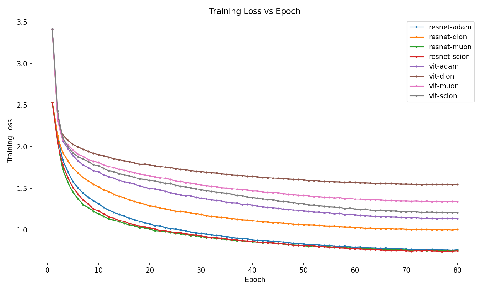
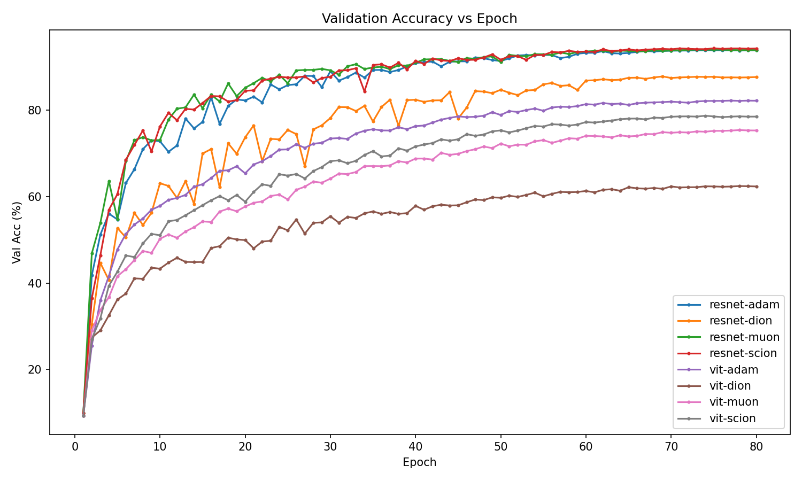

# CIFAR-10 Optimizer Benchmark

This project benchmarks the performance of several optimizers (Adam, Muon, Scion, and Dion) on the CIFAR-10 dataset, using both ResNet-18 and a small Vision Transformer (ViT) model. Group project for "EE556 - Mathematics of Data" EPFL course.

## Setup and Usage

To reproduce the results, follow these steps:

1.  **Clone the repository and install the dependencies:**

    ```bash
    git clone <repository-url>
    cd <repository-folder>
    pip install -r requirements.txt
    ```

2.  **Run the training scripts:**

    The following commands were used to train the models. Each command trains a specific model with a specific optimizer for 80 epochs with mixed precision. Default hyperparameters can be seen Args dataclass in `training.py`.
    We reccomend using less amount of epochs if running on a standard machine. We conducted our experiment with 80 epochs, that took around 2 hours on NVIDIA RTX5090.

    ```bash
    # ResNet18 + Optimizers
    python training.py --model resnet --opt adam  --epochs 80 --amp --out_dir ./results/resnet_adam
    python training.py --model resnet --opt dion  --epochs 80 --amp --out_dir ./results/resnet_dion
    python training.py --model resnet --opt muon  --epochs 80 --amp --out_dir ./results/resnet_muon
    python training.py --model resnet --opt scion --epochs 80 --amp --out_dir ./results/resnet_scion

    # MiniViT (ViT-small for CIFAR) + Optimizers
    python training.py --model vit --opt adam  --epochs 80 --amp --out_dir ./results/vit_adam
    python training.py --model vit --opt dion  --epochs 80 --amp --out_dir ./results/vit_dion
    python training.py --model vit --opt muon  --epochs 80 --amp --out_dir ./results/vit_muon
    python training.py --model vit --opt scion --epochs 80 --amp --out_dir ./results/vit_scion
    ```

4.  **Generate the summary and plots:**

    Run the `main.ipynb` notebook to generate a summary of the results and the comparison plots.

## Repository Structure

*   `main.ipynb`: A Jupyter Notebook to visualize the training results and generate plots.
*   `training.py`: The main script for training the models.
*   `requirements.txt`: A list of the Python dependencies required to run the project.
*   `models/`: Contains the ResNet and ViT model definitions.
*   `optimizers/`: Contains the implementations of the custom optimizers.
*   `utils/`: Contains utility functions for data loading and other miscellaneous tasks.
*   `report/`: Contains the output plots from the analysis.
*   `results/`: The default directory where training logs and summaries are saved.

## Results

The following plots show the training loss and validation accuracy versus the number of epochs for each optimizer and model.

**Training Loss vs. Epoch**



**Validation Accuracy vs. Epoch**



## Conclusions

-   **Scion** demonstrates early-epoch acceleration and competitive final accuracy, especially on ResNet.
-   **Muon** shows a trade-off between more expensive updates and good conditioning, with expected gains in longer runs or larger models.
-   **Dion** is optimized for synchronous, communication-efficient training at scale and its performance is not fully exercised in this single-GPU setup.
-   **Adam** remains a strong general-purpose baseline, particularly for the small ViT.


